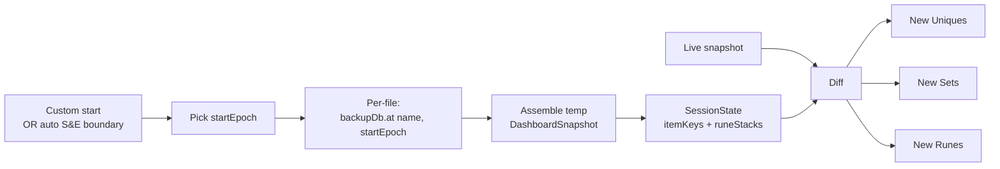
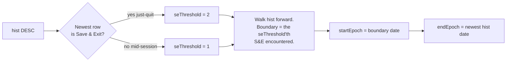
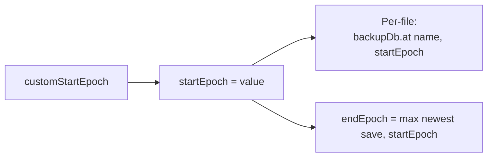
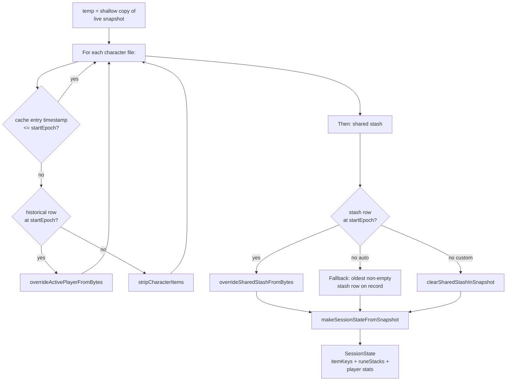
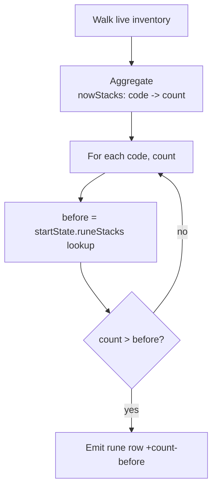

# Session window + diff logic

This document describes how the Session Info / Character / Session
panes decide what counts as "new" during a play session.

A **session** is an arbitrary `[startEpoch, endEpoch]` time window.
Both endpoints default to sensible values and can be overridden by
the user through the config menu's free-form time entry.

Implementation entry point: `buildSession` in
[src/dashboard_ftxui.cpp](../src/dashboard_ftxui.cpp).

---

## Terminology

- **Backup DB**: a per-file history of save-file bytes over time
  (`backups.sqlite`). Every save event lands a row keyed on
  `(filename, date, state)` with the raw bytes attached.
- **Session start**: the moment the session began. Either **auto**
  (derived from the backup history) or **custom** (user-fixed).
- **Session end**: the moment the session ended. Either **auto**
  (= "now" / live snapshot) or **custom** (user-fixed).
- **Start state** (`SessionState`): the account-wide slice we care
  about at the start moment — active player stats + a set of
  identified-item fingerprints + a per-code rune count map. This is
  what the renderer diffs against.

**Invariant.** A custom end requires a custom start. The config
menu only surfaces the end control when start is already custom;
the JSON loader clears the end when the start is auto.

---

## Overview

The pipeline is memoised: consecutive rebuilds during autosave
bursts return the cached `Session` as long as the cache key is
unchanged.

---

## Auto start (default)

The **auto** start tracks whatever Save & Exit last ended a
session; the current session covers everything since that S&E.

**Fallback.** No qualifying S&E on record → start on the oldest
save so the diff still says something (represents "everything since
the DB started tracking this character").

---

## Custom start

Triggered by the user typing a datetime into the "start: custom"
config menu. The epoch is a moment in time; the start-state
represents the account's state at that moment.

Each file's row is picked with `date <= startEpoch`. If a file has
no row at or before that moment (didn't exist yet), its current
items are stripped from `temp` — an empty contribution.

**Pre-history start** — a custom start *before* any recorded save —
resolves to `nullopt` for every file, producing an empty start-
state. Every currently-owned item then counts as "new since session
started" (matches user intent: "session started before I had any
saves; everything I own is new since then").

---

## Custom end

When set, `customEndEpoch` clamps the displayed session window's
end. If `customEndEpoch < startEpoch`, both collapse to the end so
the pane reads "0h 00m 00s starting at &lt;end&gt;" instead of a
negative duration.

**Diff endpoint.** The custom-end value bounds the *displayed*
start/end/duration only. The item/rune diff endpoint remains the
live snapshot. (A follow-up may pre-compute an `endState` from
historical bytes so the diff excludes activity between end and now;
today the semantic matches the previous pin-end behavior.)

---

## Assembling the start state

For each file, the same per-file semantic applies uniformly — the
active player has no special role.

The `character.timestamp <= startEpoch` shortcut is a fast path —
files untouched since the start already reflect the start state and
skip the historical parse entirely. The parse cost is only paid on
cache misses (session-boundary crosses, custom start/end changes).

---

## Diff computation

### New Uniques / Sets

Identified items with a non-zero fingerprint whose fingerprint
isn't in the start-state's item-key set:

Fingerprints are per-instance identifiers embedded in the item
bytes. When an item moves from character A → shared stash →
character B, the fingerprint stays the same; the start-state's key
set (populated from all files) already contains it, so the item is
NOT flagged as new.

### New Runes

Runes are Normal-quality stackables and don't carry fingerprints,
so the diff works on per-code counts:

Because both `startState.runeStacks` and the live `nowStacks` sum
across **every** file in the account, a rune that moved from
character A to character B during the session cancels out (both
sides include it, so `count - before = 0`).

---

## Caching

The cache key is
`(characterDate, stashDate, customStartEpoch, customEndEpoch)`.
Autosave bursts leave all four unchanged, so the cache hits and the
parser is untouched. On a hit that only advances the session window
(a new autosave lands within the current session), the cache
returns a shallow-cloned `Session` with updated `startEpoch` /
`endEpoch` — no byte parsing.

The cache is invalidated by:

- Auto mode: a new Save & Exit crossing the session boundary.
- Custom mode: the user changing `customStartEpoch` or
  `customEndEpoch`.
- Any pane's "reset session" action.

---

## What the pane displays

| Field | Source |
|---|---|
| Title suffix | `(custom start)` / `(custom start + end)` when set |
| `Start` | `session->startEpoch`, formatted local |
| `End`   | `session->endEpoch`, formatted local |
| `Time`  | `endEpoch - startEpoch` as `Xh MMm SSs` |
| `New Uniques`, `New Sets` | Diff against `session->startState.itemKeys` |
| `New Runes` | Diff against `session->startState.runeStacks` |

---

## References

- `buildSession` — [src/dashboard_ftxui.cpp](../src/dashboard_ftxui.cpp)
- `overrideActivePlayerFromBytes` /
  `overrideSharedStashFromBytes` / `clearSharedStashInSnapshot` —
  [src/dashboard_model.cpp](../src/dashboard_model.cpp)
- `makeSessionStateFromSnapshot`, `Session` / `SessionState` structs —
  [include/d2r/DashboardModel.hpp](../include/d2r/DashboardModel.hpp),
  [src/dashboard_model.cpp](../src/dashboard_model.cpp)
- `SessionCacheKey`, `renderSessionLootPane` —
  [src/dashboard_ftxui.cpp](../src/dashboard_ftxui.cpp)
- `parseUserDateTime` (manual time entry) —
  [src/dashboard_config.cpp](../src/dashboard_config.cpp)
