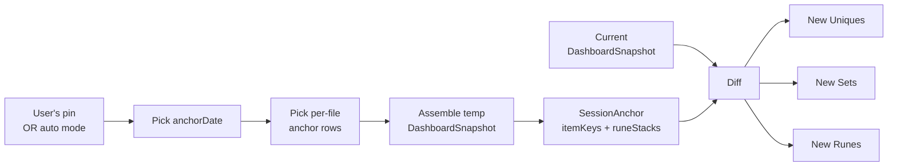
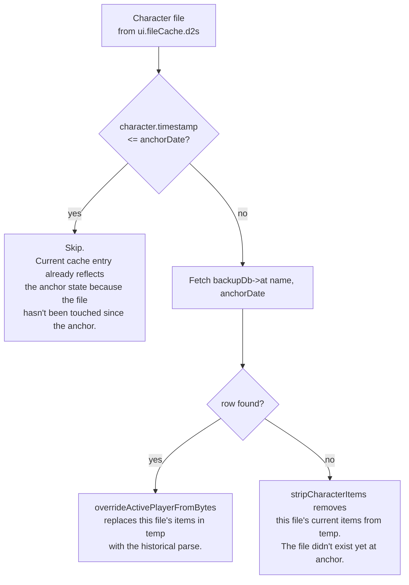
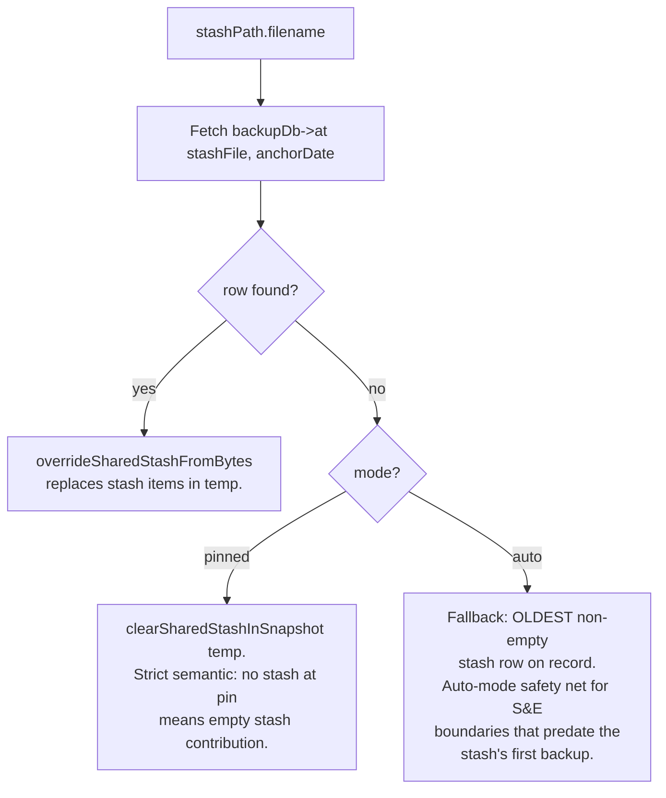
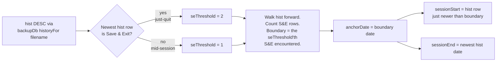
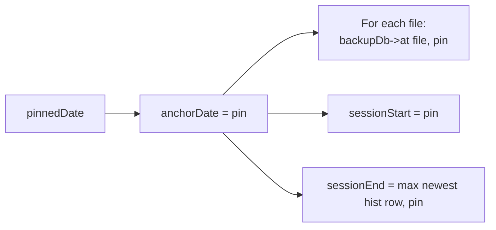
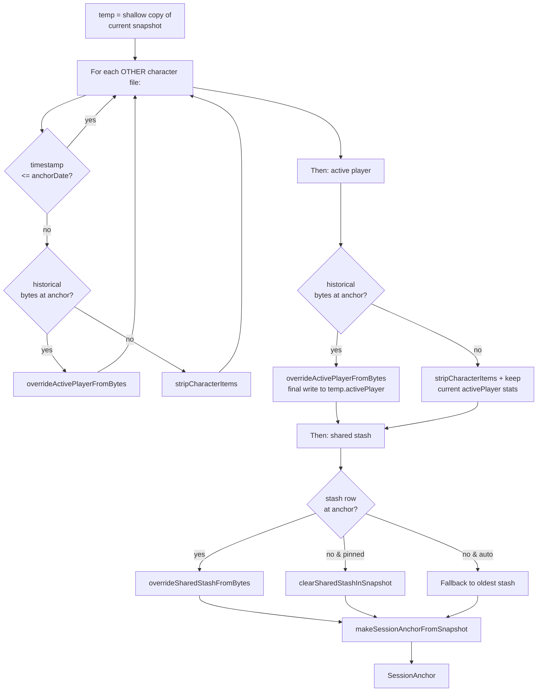
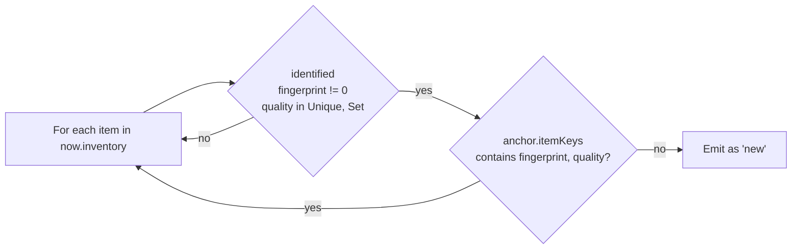
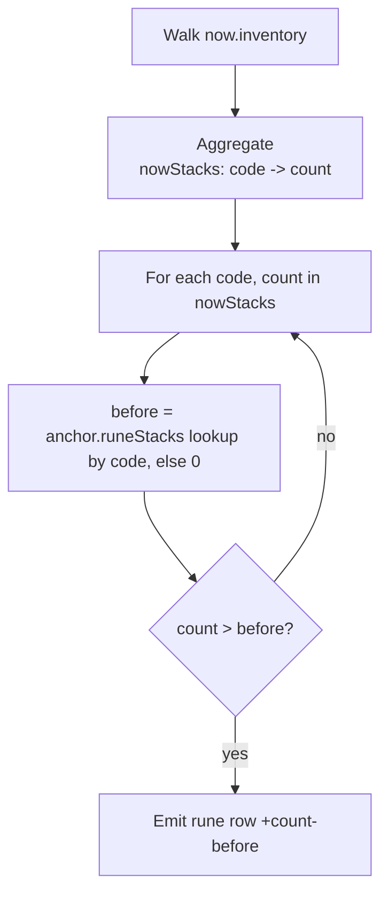
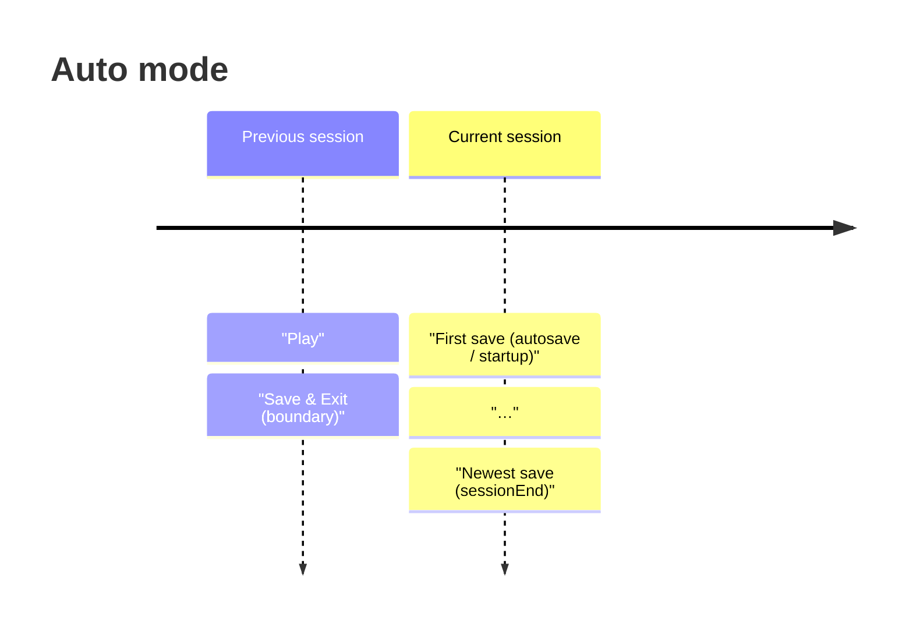
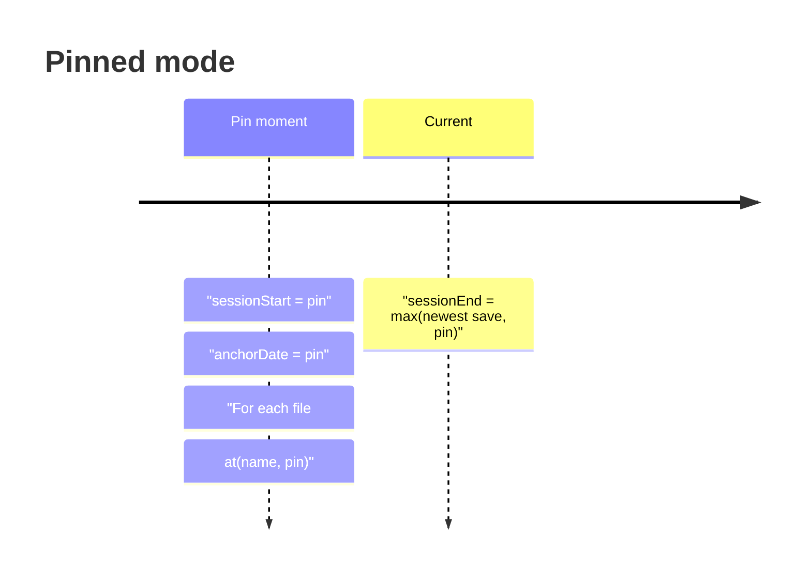

# Session anchor + diff logic

This document describes how the Session Info / Character / Session panes
decide what counts as "new" during a play session. It covers two
questions:

1. **Which save file (and which stash file) is selected as the
   baseline?** — the "anchor snapshot" construction.
2. **How is the diff between the anchor and the current snapshot
   computed?** — the per-item comparison that populates the New
   Uniques / New Sets / New Runes lists.

Implementation entry point: `buildSessionAnchor` in
[src/dashboard_ftxui.cpp](../src/dashboard_ftxui.cpp).

---

## Terminology

- **Backup DB**: a per-file history of save-file bytes over time
  (`backups.sqlite`). Every save event lands a row keyed on
  `(filename, date, state)` with the raw bytes attached.
- **Anchor snapshot**: an in-memory `DashboardSnapshot` that
  represents the account's state at the *start* of the current
  session. Compared against the *current* snapshot to compute new
  items.
- **Session window**: a `[sessionStartEpoch, sessionEndEpoch]` pair
  displayed at the top of the Session Info pane as Start / End /
  Time.
- **anchorDate**: the moment the anchor represents. In pinned mode
  it's the user's manual pin; in auto mode it's the previous
  session's Save-and-Exit backup timestamp.

---

## Overview

The whole pipeline is memoised: successive rebuilds during autosave
bursts return the cached anchor as long as `anchorDate`, `stashDate`,
and the pin dates are unchanged.

---

## Which files get selected

For any anchor moment `anchorDate`, three groups of files contribute
to the anchor snapshot:

| Group | Source in `DashboardFileCache` | Anchor row |
|---|---|---|
| **Active player** (`filename` = `current->activePlayer.file`) | `d2s[filename]` | `backupDb->at(filename, anchorDate)` |
| **Other characters** (each other `.d2s`) | `d2s[otherName]` | `backupDb->at(otherName, anchorDate)` — only when `otherEntry.character.timestamp > anchorDate` |
| **Shared stash** (`.d2i`) | `stash` | `backupDb->at(stashFile, anchorDate)` |

`backupDb->at(name, date)` returns the newest backup row for `name`
whose `date <= date`. When there is no such row (i.e., the file
didn't exist yet at that moment), the row is `nullopt` and the
file's items are stripped from `temp` — an empty contribution.

### Decision tree per character file

The `timestamp <= anchorDate` shortcut is the fast path — files
untouched during the session (typically the vast majority in a
save directory of storage characters) skip the historical parse
entirely. The historical parse cost is only paid on cache misses,
which occur at session-boundary crosses or pin changes.

### Shared stash

---

## Anchor modes

### Auto mode

The default. The anchor tracks whatever Save & Exit last ended a
session; the current session is everything since that S&E.

**Fallback**: no qualifying S&E on record → anchor on the oldest
save so the diff still says something (represents "everything since
the DB started tracking this character").

### Pinned mode

Triggered by a user pin (backup picker or manual time entry). The
pin is a *moment in time*; the anchor represents the account's state
at that moment.

Because each file's row is chosen with the operator `date <= pin`,
setting the pin to an *exact backup's timestamp* still lands on that
same row (equality wins). The behavior of "picking a save file from
the backup picker" is preserved.

**Pre-history pin** — a pin *before* any recorded save — resolves to
`nullopt` for every file. All files are stripped from `temp` and the
resulting anchor snapshot is empty, so every currently-owned item
counts as "new since session start". This matches the intent
"session started before I had save games; everything I own is new
since then".

---

## Assembling the anchor snapshot (`temp`)

The active player is handled *last* so its call has the final say on
`temp.activePlayer` (the loop's earlier calls for other characters
also touch that field as a side effect; the last write wins).

---

## Diff computation

Given `anchor` (a `SessionAnchor`) and `now` (a `DashboardSnapshot`),
the Session Info pane produces three lists.

### New Uniques / New Sets

Identified items with a non-zero fingerprint whose fingerprint isn't
present in the anchor's item-key set:

Fingerprints are per-instance identifiers embedded in the item
bytes. When an item moves from character A → shared stash →
character B, the fingerprint stays the same; the anchor's key set
(populated from `temp.inventory` at anchor time) already contains
that fingerprint, so the item is NOT flagged as new.

### New Runes

Runes are Normal-quality stackables and don't carry fingerprints, so
the diff works on per-code counts:

Because both `anchor.runeStacks` and the current `nowStacks` sum
across **every** file in the account, a rune that moved from
character A to character B during the session cancels: `before` and
`count` both include the migrated rune, so `count - before = 0` and
no new-rune row is emitted.

---

## Session window

The Start / End / Time rows at the top of the Session Info pane
come from `anchor->sessionStartEpoch`, `anchor->sessionEndEpoch`, and
`sessionEnd - sessionStart` respectively.

### Timeline

In auto mode the anchor is the boundary S&E; the session window is
"first save after boundary" → "newest save on record".

In pinned mode the window's Start is the pin itself. End clamps to
`max(newest save, pin)` so a pin newer than every backup renders as
a 0-length window ("0h 00m 00s starting at <pin>") rather than a
negative duration.

---

## Caching

Rebuilding the anchor snapshot involves parsing historical bytes for
every file whose timestamp is newer than the anchor. During autosave
bursts (a save event lands every few seconds while playing) we only
want to pay that cost once.

The cache key is `(characterDate, stashDate, pinnedDate,
pinnedEndDate)`. Autosave bursts leave all four unchanged, so the
cache hits and the parser is untouched. On a hit that only advances
the session window (a new autosave lands within the current
session), the cache returns a shallow-cloned anchor with updated
`sessionStartEpoch` / `sessionEndEpoch` — no byte parsing.

The cache is invalidated by:

- Auto mode: a new Save & Exit crossing the session boundary.
- Pinned mode: the user changing a pin.
- Anchor pane's "reset session anchor now" action.

---

## What the pane displays

| Field | Source |
|---|---|
| Title suffix | `(pinned start)` / `(pinned end)` / `(pinned)` based on pin state |
| `Start` | `anchor->sessionStartEpoch`, formatted local |
| `End`   | `anchor->sessionEndEpoch`, formatted local |
| `Time`  | `sessionEnd - sessionStart` as `Xh MMm SSs` |
| `New Uniques`, `New Sets` | Diff against `anchor->itemKeys` |
| `New Runes` | Diff against `anchor->runeStacks` |

---

## References

- `buildSessionAnchor` — [src/dashboard_ftxui.cpp](../src/dashboard_ftxui.cpp)
- `overrideActivePlayerFromBytes` /
  `overrideSharedStashFromBytes` / `clearSharedStashInSnapshot` —
  [src/dashboard_model.cpp](../src/dashboard_model.cpp)
- `makeSessionAnchorFromSnapshot`, `SessionAnchor` struct —
  [include/d2r/DashboardModel.hpp](../include/d2r/DashboardModel.hpp),
  [src/dashboard_model.cpp](../src/dashboard_model.cpp)
- `SessionAnchorCacheKey`, `renderSessionLootPane` —
  [src/dashboard_ftxui.cpp](../src/dashboard_ftxui.cpp)
- `parseUserDateTime` (manual time entry) —
  [src/dashboard_config.cpp](../src/dashboard_config.cpp)
