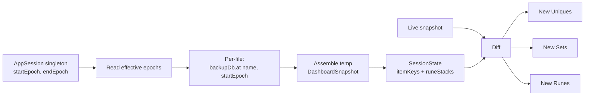
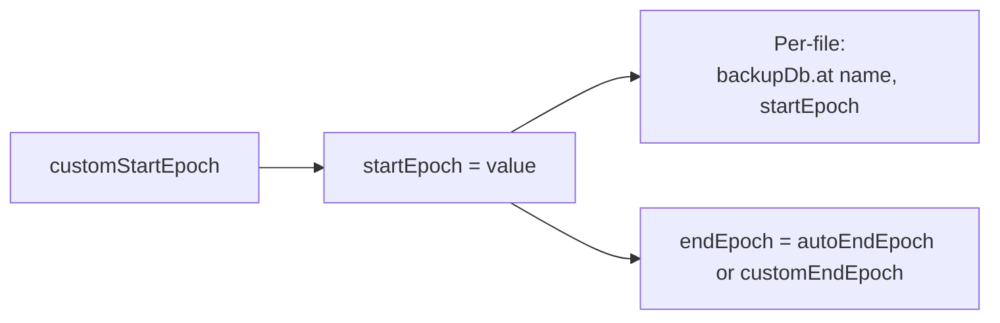
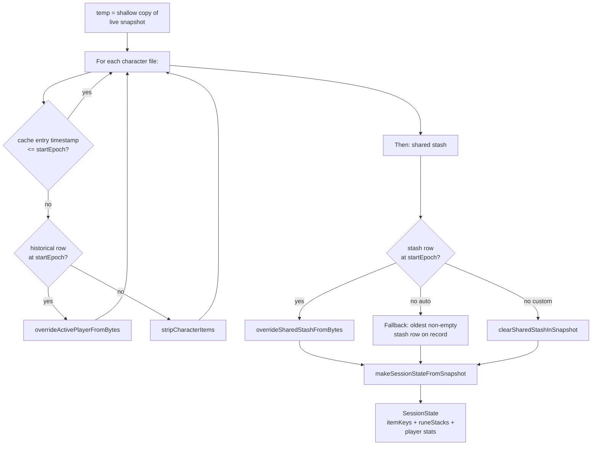
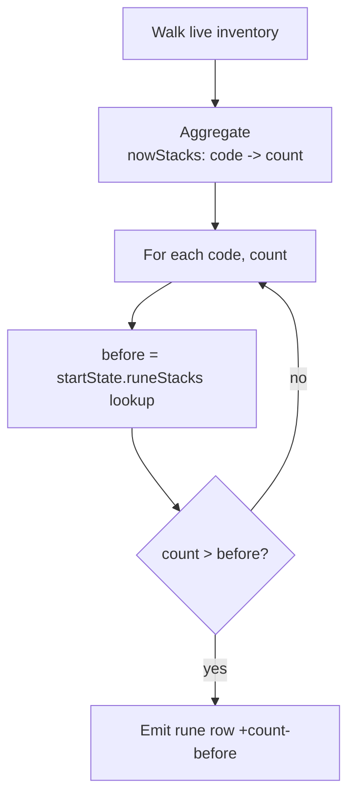

# Session window + diff logic

This document describes how the Session Info / Character / Session
panes decide what counts as "new" during a play session.

A **session** is an arbitrary `[startEpoch, endEpoch]` time window.
Both endpoints default to sensible values and can be overridden by
the user through the config menu's free-form time entry.

Implementation entry point: `buildSession` in
[src/dashboard_ftxui.cpp](../src/dashboard_ftxui.cpp).

---

## Terminology

- **Backup DB**: a per-file history of save-file bytes over time
  (`backups.sqlite`). Every save event lands a row keyed on
  `(filename, date, state)` with the raw bytes attached.
- **Run**: the interval from entering the game (a `Play` click) to
  the next `Save & Exit`. Contains zero or more Autosave backups
  and is closed by exactly one SaveAndExit backup. Runs are
  **per-character** — each `.d2s` has its own runs.
- **Session**: an arbitrary `[startEpoch, endEpoch]` time window
  during which we count runs. Sessions are
  **character-agnostic** — a session collects whichever runs
  happen to land inside its window, regardless of which character
  played them.
- **Session start**: the moment the session began. Either **auto**
  (derived from the backup history) or **custom** (user-fixed).
- **Session end**: the moment the session ended. Either **auto**
  (= "now" / live snapshot) or **custom** (user-fixed).
- **Start state** (`SessionState`): the account-wide slice we care
  about at the start moment — active player stats + a set of
  identified-item fingerprints + a per-code rune count map. This is
  what the renderer diffs against.

Backend / UI vocabulary split: the enum value is
`BackupDb::State::SaveAndExit` (naming the in-game action); the
user-facing display term for the resulting backup is **"run end"**
(see `backupStateShortLabel` in
[src/dashboard_ftxui.cpp](../src/dashboard_ftxui.cpp)).

### Runs vs sessions

- A **run start** is either the previous run's SaveAndExit backup
  timestamp OR the session start, whichever is later. Runs that
  straddle the session boundary have their left bound clipped to
  the session start.
- A **session** is not tied to a specific character. Two runs by
  different characters that both close inside the same session
  window both count toward that session.
- Programmatic access: `groupRunsForFile(historyRows, sessionStart)`
  in
  [include/d2r/DashboardModel.hpp](../include/d2r/DashboardModel.hpp)
  returns a `std::vector<Run>` for a single file's history. Pass
  `sessionStart = 0` to disable clipping (used by the Backups
  pane, which shows a file's full run history uncollapsed by
  session).

**Invariant.** A custom end requires a custom start. The
`AppSession::setCustomEnd` helper silently drops end values when
start is unset; `setCustomStart(nullopt)` also clears the end.
The config menu on Session / Session Info / Character panes
mirrors this by only surfacing the "end" control when start is
already custom.

---

## Overview

The pipeline is memoised: consecutive rebuilds during autosave
bursts return the cached `Session` as long as the cache key is
unchanged.

---

## Auto start (default)

The **auto** start is the current value of
`AppSession::autoStartEpoch`. On dashboard boot it seeds to the
wall-clock time. Whenever the watcher fires a launch-burst
callback (see [Launch-burst detection](#launch-burst-detection)
below), the value shifts to the burst's timestamp. Custom
overrides via `AppSession::customStartEpoch` are sticky and win
via `AppSession::startEpoch()`'s `value_or(...)`.

There is no per-character S&E boundary scan. The old auto-mode
"walk hist to find the boundary S&E" heuristic is gone — the
singleton is the sole source of truth for the effective start.

**Fallback.** With no launch burst detected and no user
override, the effective start remains at dashboard-boot time,
which is the natural "start of the current dashboard's
observation window".

---

## Launch-burst detection

`kSaveDirMask` in the watcher includes `IN_ACCESS`, so the
scheduler sees the reads D2R.exe emits at startup. The
`backup_scheduler_detail::isLaunchBurst` predicate flags a burst
that is:

- Reads-only (no `IN_CLOSE_WRITE | IN_MODIFY | IN_MOVED_TO |
  IN_CREATE` on any file), AND
- Contains at least one read on a non-`.d2s`/`.d2i` file
  (any `.ctl`, `.key`, `.ma*`, `.map`, or `Settings.json`).

The second clause distinguishes a real D2R launch from the
dashboard's own `takeStartupSnapshot` (which only reads
`.d2s`/`.d2i` per `isPersistedFile`).

On a match, `BackupScheduler` invokes the launch callback
installed by `runDashboard`, which updates
`ui.appSession.autoStartEpoch` under the snapshot mutex and posts
a redraw event. **No row is written to the backup DB** — launch
events are purely observational.

---

## Custom start

Triggered by the user typing a datetime into the "start: custom"
config menu on any Session / Session Info / Character pane. The
menu writes to `AppSession::customStartEpoch` via
`setCustomStart`; `startEpoch()` then returns the custom value.
The epoch is a moment in time; the start-state represents the
account's state at that moment.

Each file's row is picked with `date <= startEpoch`. If a file has
no row at or before that moment (didn't exist yet), its current
items are stripped from `temp` — an empty contribution.

**Pre-history start** — a custom start *before* any recorded save —
resolves to `nullopt` for every file, producing an empty start-
state. Every currently-owned item then counts as "new since session
started" (matches user intent: "session started before I had any
saves; everything I own is new since then").

Custom overrides are **sticky**: they persist until the user hits
"reset session" (`AppSession::clearCustom`) even if a later launch
burst arrives.

---

## Custom end

When set, `customEndEpoch` clamps the displayed session window's
end. If `customEndEpoch < startEpoch`, both collapse to the end so
the pane reads "0h 00m 00s starting at &lt;end&gt;" instead of a
negative duration.

`AppSession::setCustomEnd(v)` enforces the invariant "custom end
requires custom start" — calling it while `customStartEpoch` is
unset silently drops the value.

**Diff endpoint.** The custom-end value bounds the *displayed*
start/end/duration only. The item/rune diff endpoint remains the
live snapshot. (A follow-up may pre-compute an `endState` from
historical bytes so the diff excludes activity between end and now;
today the semantic matches the previous pin-end behavior.)

---

## Assembling the start state

For each file, the same per-file semantic applies uniformly — the
active player has no special role.

The `character.timestamp <= startEpoch` shortcut is a fast path —
files untouched since the start already reflect the start state and
skip the historical parse entirely. The parse cost is only paid on
cache misses (session-boundary crosses, custom start/end changes).

---

## Diff computation

### New Uniques / Sets

Identified items with a non-zero fingerprint whose fingerprint
isn't in the start-state's item-key set:

Fingerprints are per-instance identifiers embedded in the item
bytes. When an item moves from character A → shared stash →
character B, the fingerprint stays the same; the start-state's key
set (populated from all files) already contains it, so the item is
NOT flagged as new.

### New Runes

Runes are Normal-quality stackables and don't carry fingerprints,
so the diff works on per-code counts:

Because both `startState.runeStacks` and the live `nowStacks` sum
across **every** file in the account, a rune that moved from
character A to character B during the session cancels out (both
sides include it, so `count - before = 0`).

---

## Caching

The cache key is `(characterDate, stashDate, startEpoch)`.
`endEpoch` is deliberately NOT part of the key — new saves
landing advance `autoEndEpoch` but the start-state's item pool is
invariant under end drift, so we clone-and-patch the cached
`Session` with the new `endEpoch` and return it. The renderer's
duration display stays live during autosave bursts without any
byte parsing.

The cache is invalidated by:

- A new backup landing at/before `startEpoch` on the active
  player's file (character-side row date shifts).
- The user changing the custom start / end (via time-input modal).
- A launch burst updating `autoStartEpoch` (the effective
  `startEpoch` shifts).
- A "reset session" action clearing custom overrides.

---

## What the pane displays

| Field | Source |
|---|---|
| Title suffix | `(custom start)` / `(custom start + end)` when set |
| `Start` | `session->startEpoch`, formatted local |
| `End`   | `session->endEpoch`, formatted local |
| `Time`  | `endEpoch - startEpoch` as `Xh MMm SSs` |
| `New Uniques`, `New Sets` | Diff against `session->startState.itemKeys` |
| `New Runes` | Diff against `session->startState.runeStacks` |

---

## References

- `AppSession` singleton, `Session` / `SessionState` structs,
  `makeSessionStateFromSnapshot`, `Run` / `groupRunsForFile` —
  [include/d2r/DashboardModel.hpp](../include/d2r/DashboardModel.hpp),
  [src/dashboard_model.cpp](../src/dashboard_model.cpp)
- `buildSession`, `SessionCacheKey`, `renderBackupsDetail` (run-
  collapse view), `renderSessionLootPane`, launch-callback
  installation — [src/dashboard_ftxui.cpp](../src/dashboard_ftxui.cpp)
- `overrideActivePlayerFromBytes` /
  `overrideSharedStashFromBytes` / `clearSharedStashInSnapshot` —
  [src/dashboard_model.cpp](../src/dashboard_model.cpp)
- `isLaunchBurst`, `BackupScheduler::setLaunchCallback` —
  [include/d2r/BackupScheduler.hpp](../include/d2r/BackupScheduler.hpp),
  [src/backup_scheduler.cpp](../src/backup_scheduler.cpp)
- `kSaveDirMask` (`IN_ACCESS` inclusion) —
  [src/watcher_inotify.cpp](../src/watcher_inotify.cpp)
- `parseUserDateTime` (manual time entry) —
  [src/dashboard_config.cpp](../src/dashboard_config.cpp)
